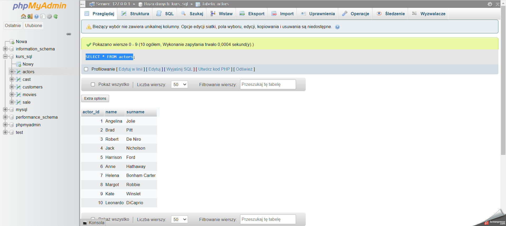
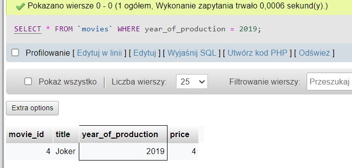
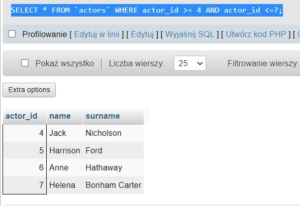
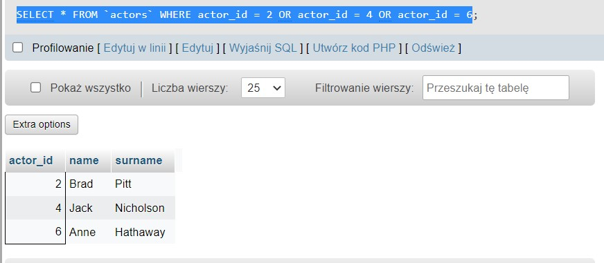
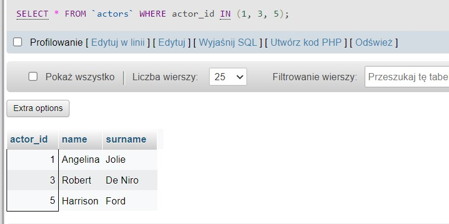
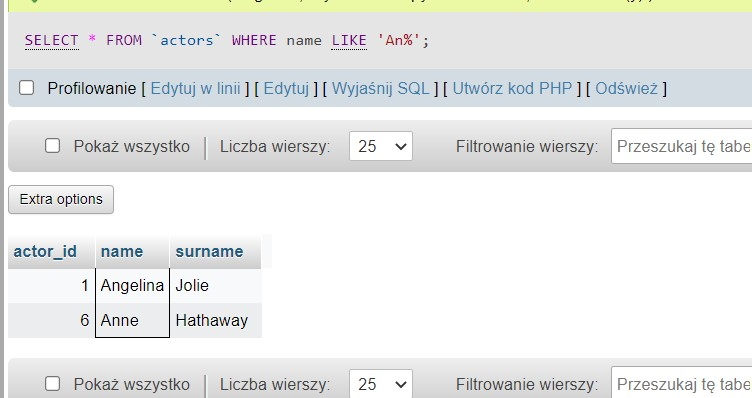
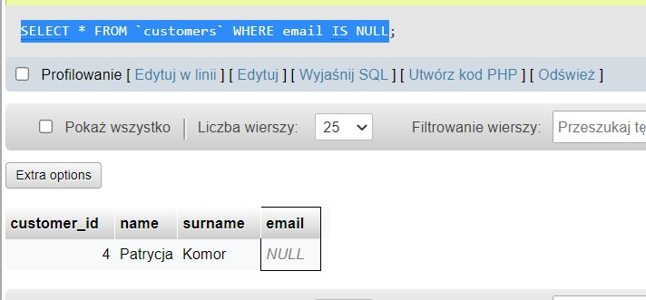

# Portfolio_challenge_maja_

### “TASK 1”

#### “Subtask 1”

 Moj wynik testu to : 8/10 
 😊

#### “Subtask 3”

 Cześć , nazywam się Maja. Biorę udział w  wyzwaniu Porfolio challenge ponieważ postawiłam sobie za cel zmiane branży a przede wszystkim pracy. 😎 Podjęłam już wczesniej kroki,aby osiągnąc zamierzony cel. Zaczęłam się uczyć  Pythona (do którego również zamierzam wrócić), jak również czytałam sylabus i rozwiązywałam testy. To czego mi brakuje to  potrfolio które mogłabym przesyłać razem z CV oraz praktyka, któej mi brakuje. Pokładam ogromną nadzieję że dzięki wyzwaniu uda mi sie ustystematyzować wiedzę jak i zbudować podstawy do tego, aby czuć że jestem juz gotowa wysyłać swoja kandydature na stanowisko Testera.🙌 Prywatnie jestem miłośniczką chodzenia po górach 🏂, jogi oraz czytania ksiązek (zwłaszcza kryminałów). W wolnym czasie staram się również pomagać fundacjom/domom tymczasowym które zajmują się ratowaniem kotów 😺. 

#### “Subtask 4”

1. Na czym polega ta aplikacja? Do czego służy?

* Aplikacja jest dla łowców talentów , słuzy do przeglądania wskaźników,umiejętności i pozycji zawodników.

2. Funkcjonalności

* logowanie do systemu
  
* wylogowanie z systemu
  
* dodawanie uzytkownika z pewnymi atrybutami m.in: 
  
* data urodzin 
   * możliwośc dodania wieku ujemnego , oraz nierealnego np 5000 lat (podczas uzupełniania daty narodzin zawodnika wybiera się dzień, miesiąc i rok . Podczas wybierania roku jeśli to nie jest aktualny rok, trzeba ponownie wybrac miesiąc i dzień).
  
* dodawanie numeru telefonu użytkownika
   * możliwośc dodania jakigokolwiek znaku, brak wytycznych jeśli chodzi o ilość znaków
  
* dodawanie języków któymi posługują się zawodnicy
   * możliwośc wpisania czegokolwiek , moze gdyby była lista łatwiej byłoby poźniej wyfiltrować zawodników z odpowiednimi umiejętnościami
  
* link do youtuba:
   * powinien byc okreslony fromat co mozna tam wkleic , na ta chwile mozna wpisac kazdy znak,po kliknięciu W NIEPRAWIDLOWY LINK POKAZUJE SIE BLAD 404 page not found
* pozycja gracza
   * możliwość dodania każdego znaku sprawia ze nie można filtrować efektywnie po pozycji piłkarza , problem prawdopdoobnie rozwiązałaby lista rozwijana
* waga gracza
   * możliwośc wpisania czegokolwiek , jakiegokolwiek znaku, możliwośc wpisania wagi ujemnej 
  
* filtorwanie
   * brak możliwośći filtrowania po ilości rozegranych meczów
   * wprowadzenie błednych danych uniemożliwia efektywne filtorwanie 
  
* tworzenie meczu
   * możliwosc uzupełnienia jakiekolwiek daty meczu np.2025 , możliwosc uzupełnienia wyniku itp do meczy któy ma się odbyć za dwa lata .
   * możliwośc wpisania dowolnego czasu trwania meczu, np 900 minut . Jest to niezgodne z zasadami gry.
  
* tworzenie listy zdarzeń
   * brak przekierowania zdarzeń, przez co nie wiedziałam jak je dodać, wg mnie mało intuicyjne
  
* tworzenie raportu
   * brak możliwości wpisania fauli
 
3. Interfejs aplikacji
  
    Interfejs aplikacji ma neuralne kolory więc nie męczy oczu . Jest poprawny.
  
4. Czy aplikacja jest intuicyjna?
  
    Większość rzeczy tak , aczkolwiek ja miałam problem ze scout panel . Nie wiedziałam w jaki sposob się zalogować, na jakie konto, gdzie żeby móc rozegrać mecz.
  
5. Czy zauważasz jakieś błędy? Albo coś wydaje Ci się błędem?
  
    Jedyny bład jaki mi wysoczył to błąd 404 podczas kliknięcia w link który nie istniał. Wszelkie komentarze apropo tego co mi się wydaje błędem dodałam w punkcie 2 pod każdą z funkcjonalności.
    
  
  

  
  #### “Subtask 5”
  JIRA

----------------------------------------

### “TASK 2”  

#### “Subtask 1”

 Pisanie przypadków testowych na podstawie USER STORY 

Rozwiązanie:  

https://docs.google.com/spreadsheets/d/1Ln3iWJ-x3F1NpU3ISULHPwsSWNyXMNY8ViwyIWCr7qQ/edit?usp=sharing

#### “Subtask 2”

 Pisanie przypadków testowych na podstawie własnych doświadczeń 

Rozwiązanie:  

https://docs.google.com/spreadsheets/d/1kR1Tow0hsLHl5GB6kjmcdeVEAFvSJg1b4hgSxNgo6I0/edit?usp=sharing

#### “Subtask 3”

Po co piszemy test case'y? 

Test casy są pisane w celu udokumentówania w przejrzysty sposób jak różne możliwości obsłuzenia modułów sa w danej aplikacji. 
Mogą być rownież bardzo dobrym źródłem informacji o aplikacji którą testujemy.
Dobre pokrycie przypadkami testowymi oprogramowania daje nam pewność, że nie zostały pominięte żadne ważne funckjonalności.  

  

> [!UWAGA]
> [A na koniec cięzkiej pracy krótki filmik  ](https://youtu.be/OO3FANjwKHY).  🤣

#### “Subtask 4”

Pisanie przypadków testowych na podstawie włanych doświadczeń ( Pick Eat Up https://pickeatup.io/) 

Rozwiązanie:  

https://docs.google.com/spreadsheets/d/1p_IvMNyt3BvLAFJwj0qZYxqbq75bnNNEeMAKMn7Fyuo/edit?pli=1#gid=0

----------------------------------------

### “TASK 3”  
#### “Subtask 2”

 Testowanie według planów testów i raportowanie błędów 

https://docs.google.com/spreadsheets/d/1VoGeIhWJYYie7Jc7FUuUA0KJN-Lc6Buw4GogqKWf-q8/edit?usp=sharing

#### “Subtask 2”

 *Raport z wykonanych testów* 

https://docs.google.com/document/d/1gE3Mlz0EdnhrhCxJiF6x_umMLIiYptxUz97yV14RGTA/edit?usp=sharing

----------------------------------------

### “TASK 4”  
#### “Subtask 2”

 Testowanie eksploracyjne i raportowanie błędów - OLX 

https://docs.google.com/spreadsheets/d/1ZfZrtcyD4mK_S-xve00Uasxp0m0n6eJ-34-t3vFuXGI/edit#gid=0

#### “Subtask 3”

1.Do czego służy ta aplikacja? Jaki jest cel tej aplikacji?
 * Aplikacja sluzy do sprzedazy i kupna , lokalnie jak i wysylkowo roznego typu produktów . Mozna tam również znaleźć noclegi i usługi . Wiec tak na prawde można takm znaleźć wszystko czego potrzebujesz, od podręczników, po materiały budowlane i kosmetyczki .

2.Kto ma być użytkownikiem końcowym aplikacji?
 * Użytkownikiem końcowym aplikacji ma byc każdy kto czegoś szuka/ potrzebuje ponieważ można tam znaleźć niemalże wszystko.
  
3.Czy według Ciebie aplikacja jest user friendly? 
 * Aplikacja jest bardzo intuicyjna . Łatwo jest znaleźć to czego się potrzebuje . 

4.Jak byś usprawnił aplikację? Co byś w niej poprawił. Czy masz jakiś pomysł na dodatkową funkcjonalność? 
 * Dałabym możliwość w niekórych kategoriach jak np. ubrania/meble filtrowania po kolorze 
  
5.Jakie dostrzegasz różnice pomiędzy testowaniem aplikacji internetowej, a natywnej? 
  * Aplikacja natywna to aplikacja tworzona na konkretną platformę . Natywna aplikacja musi byc pobrana i zaintsalowana na urządzeniu np. poprzez Google Play Market i App Store. Aplikacje internetowe dzialają poprzez przeglądarke internetową .

----------------------------------------

### “TASK 4”  
#### “Subtask 2”
Najważniejsze zagadnienia które warto zapamiętać :
* SELECT * from nazwa_tabeli - wyswietla całą tabelę
* SELECT * from nazwa_tabeli WHERE wiek = 14 - wyswietla tabele z osobami które ukonczyly 14 lat 
* OR - np. SELECT * from nazwa_tabeli WHERE wiek = 14 OR wiek = 12 - pokaza nam sie wszystkie osoby ktore maja 14 lat lub 12 lat
* AND - np, SELECT * from nazwa_tabeli WHERE wiek = 14 AND name= 'Andrzej' - wyswietli nam wszystkich Andrzejow w wieku 14 lat
* ORDER BY - filtrowanie - ASC, czyli malejąco , DESC, czyli rosnąco
* IN - porownuje wartosci z podanymi danymi 
* BETWEEN – sprawdza, czy wartość mieści się w zadanym zakresie
* LIKE - wyszukuje okreslony wzorzec np. rozpoczęcie imienia na litere A - SELECT * FROM `actors` WHERE name LIKE 'A%' , jesli ma sie kończyc na a to będzie LIKE '%a', a jesli ma miec w slowim slowie np apa to uzywamy '%apa' 
* MAX - cos największego np. SELECT MAX(Price) FROM Products;

#### “Subtask 3”

 1. Wyswietl cała zawartość tabeli actors 
SELECT * FROM actors

2. Sortuj alfabetycznie po surname
SELECT * FROM `actors` ORDER BY surname;

3. Film z 2019 roku
SELECT * FROM `movies` WHERE year_of_production = 2019

4. Filmy, które powstały między 1900, a 1999 rokiem
SELECT * FROM `movies` WHERE year_of_production BETWEEN 1900 AND 1999

5. Wyświetl JEDYNIE tytuł i cenę filmów, które kosztują poniżej 7$
SELECT title, price FROM `movies` WHERE price < 7

6. Użyj operatora logicznego AND, aby wyświetlić aktorów o actor_id pomiędzy 4-7 (4 i 7 powinny się wyświetlać). NIE UŻYWAJ operatora BETWEEN
SELECT * FROM `actors` WHERE actor_id >= 4 AND actor_id <=7;

7. Wyświetl klientów o id 2,4,6 wykorzystaj do tego warunek logiczny.
SELECT * FROM `actors` WHERE actor_id = 2 OR actor_id = 4 OR actor_id = 6

8. Wyświetl klientów o id 1,3,5 wykorzystaj do tego operator IN.
SELECT * FROM `actors` WHERE actor_id IN (1, 3, 5);

9. Wyświetl dane wszystkich osób z tabeli ‘actors’, których imię zaczyna się od ciągu “An" 
SELECT * FROM `actors` WHERE name LIKE 'An%'

10. Wyświetl dane klienta, który nie ma podanego adresu email
SELECT * FROM `customers` WHERE email IS NULL

11. Wyświetl wszystkie filmy, których cena wynosi powyżej 9$ oraz ich ID mieści się pomiędzy 2 i 8 movie_id.
SELECT * FROM `movies` WHERE price > 9 AND ( movie_id BETWEEN 2 AND 8 )

